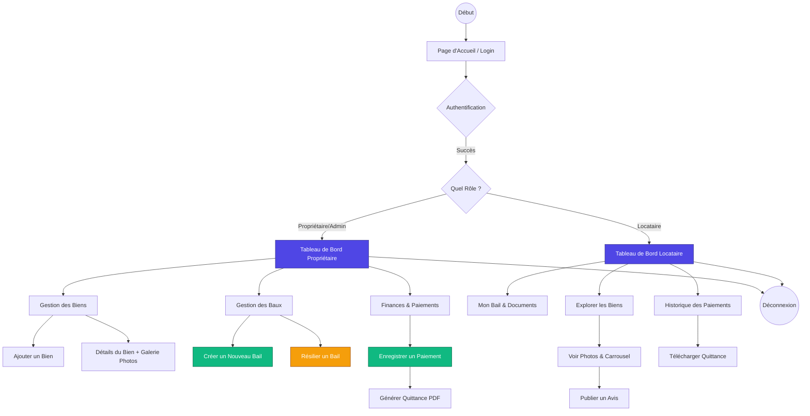

# User Flow - Plateforme Loxis

```mermaid
graph TD
    %% Entrée et Auth
    Start((Début)) --> Landing[Page d'Accueil / Login]
    Landing --> Login{Authentification}
    
    %% Choix du Rôle
    Login -- Succès --> RoleCheck{Quel Rôle ?}
    
    %% Flux PROPRIÉTAIRE
    RoleCheck -- Propriétaire/Admin --> PropDash[Tableau de Bord Propriétaire]
    PropDash --> ManageBiens[Gestion des Biens]
    ManageBiens --> AddBien[Ajouter un Bien]
    ManageBiens --> ViewBien[Détails du Bien + Galerie Photos]
    
    PropDash --> ManageLeases[Gestion des Baux]
    ManageLeases --> CreateLease[Créer un Nouveau Bail]
    ManageLeases --> TerminateLease[Résilier un Bail]
    
    PropDash --> Finances[Finances & Paiements]
    Finances --> RecordPay[Enregistrer un Paiement]
    RecordPay --> GenerateReceipt[Générer Quittance PDF]
    
    %% Flux LOCATAIRE
    RoleCheck -- Locataire --> TenDash[Tableau de Bord Locataire]
    TenDash --> MyLease[Mon Bail & Documents]
    TenDash --> Explorer[Explorer les Biens]
    Explorer --> ViewDetails[Voir Photos & Carrousel]
    ViewDetails --> PostReview[Publier un Avis]
    
    TenDash --> MyPayments[Historique des Paiements]
    MyPayments --> DownloadReceipt[Télécharger Quittance]
    
    %% Sortie
    PropDash --> Logout((Déconnexion))
    TenDash --> Logout
    
    %% Styles
    classDef primary fill:#4f46e5,color:#fff,stroke:#312e81
    classDef secondary fill:#10b981,color:#fff,stroke:#065f46
    classDef warning fill:#f59e0b,color:#fff,stroke:#92400e
    
    class PropDash,TenDash primary
    class RecordPay,CreateLease secondary
    class TerminateLease warning
```
